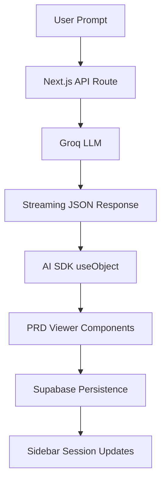
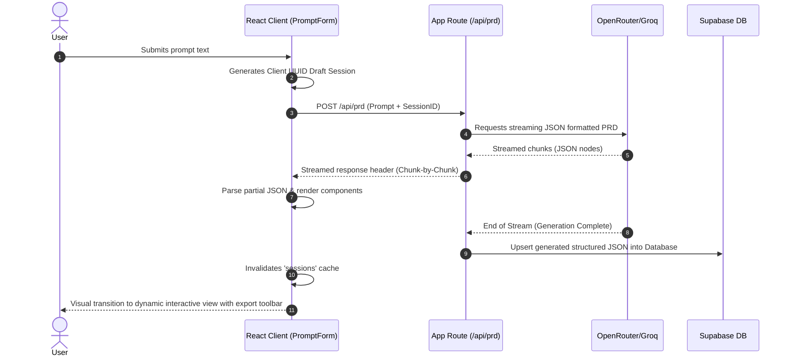
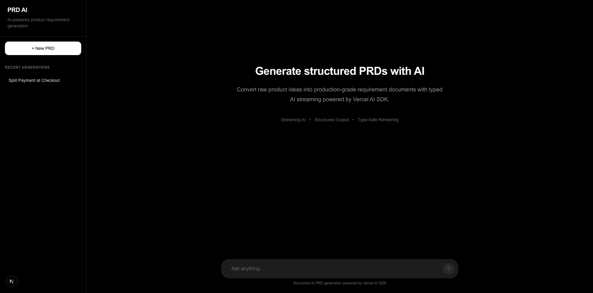
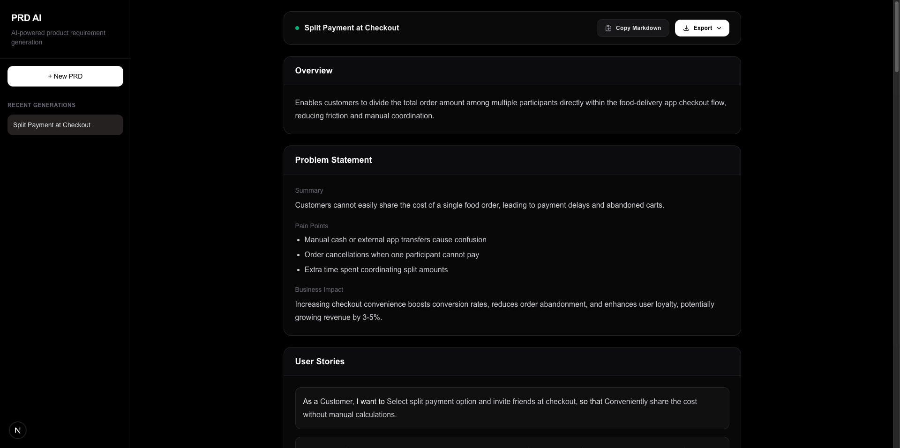

# ⚡ PRDify — AI-Powered PRD Generator

> Generate structured Product Requirement Documents (PRDs) in real-time using streaming LLMs, persistent sessions, and multi-format exports.

[](https://nextjs.org/)
[](https://opensource.org/licenses/MIT)
[]()

---

## 📖 Overview

Writing comprehensive Product Requirement Documents (PRDs) is traditionally manual and repetitive, requiring hours to synthesize user stories, edge cases, system assumptions, and metrics.

**PRDify** is a web application designed to automate this document generation lifecycle. By combining **Next.js App Router**, **Supabase**, and LLMs via **OpenRouter & Groq** (orchestrated by the **Vercel AI SDK**), PRDify delivers structured requirements in real-time. The application manages session state persistence, AI-driven recommendations, and document exports.

### Key Capabilities
- **Real-Time Structured Streaming**: Parses streaming JSON token-by-token on the client to render modular UI components incrementally as the LLM generates them.
- **Contextual Recommendation Engine**: Generates targeted feedback cards identifying metric targets, potential risks, and technical trade-offs.
- **Session Persistence**: Stores document drafts automatically in a Supabase PostgreSQL instance for context retention and session recovery.
- **Multi-Format Export**: Supports standardized Markdown formatting and layout-preserved PDF compilation.
- **Consistent Design System**: Built with modular Tailwind CSS utility classes and accessible visual feedback states.

---

## 🛠️ Tech Stack

PRDify is built with a decoupled frontend/backend architecture designed for low latency and minimal bundle size:

| Category | Technology | Description / Usage |
| :--- | :--- | :--- |
| **Frontend Framework** | Next.js 15 (App Router) | Server component rendering, dynamic routing, and API endpoints. |
| **Language** | TypeScript | Strong typing and strict interfaces for data structures. |
| **Styling** | Tailwind CSS | Utility-first layouts, responsive grids, and clean visual themes. |
| **Database & Storage** | Supabase (PostgreSQL) | Persistence layer for PRD sessions, handled via client and server-side calls. |
| **State Management**| React Query (TanStack) | Server state caching, optimistic UI updates, and synchronization. |
| **AI Orchestration** | Vercel AI SDK | Direct stream control, edge response management, and JSON validation. |
| **LLM Provider** | OpenRouter / Groq LLMs | High-throughput inference models (e.g., Llama 3, Mixtral). |
| **Export Utilities** | Custom PDF & Markdown | Structured JSON parsing to GitHub Flavored Markdown and layout-preserved print views. |

---

## 🏗️ Architecture Overview

PRDify utilizes an event-driven, streaming-first architecture. Rather than blocking the user interface while waiting for the LLM to complete its reasoning step, tokens are streamed to the client, parsed into partial JSON nodes, and rendered progressively.



### Core Architectural Flows

#### 1. Streaming & Parsing Pipeline
- The client initiates an HTTP POST request to `/api/prd`.
- The backend establishes a server-sent event (SSE) stream with the LLM API.
- As raw text chunks arrive, the client-side parser reconstructs incomplete JSON structures in real-time, allowing modular UI components to render before the full stream completes.

#### 2. Session Lifecycle
- Every unique prompt creates a draft session identified by a UUID.
- Completed or interrupted streams are validated and stored in PostgreSQL.
- Sessions are cached client-side using React Query for quick navigation and immediate rendering.

#### 3. Rendering Pipeline
- Individual PRD modules (User Stories, Metrics, NFRs) are decoupled.
- Component renders are scoped strictly to the slice of the state they consume.
- This boundary ensures that high-frequency token updates do not cause full-page re-renders.

---

## 📂 Folder Structure

The codebase is organized as a modular Next.js application:

```text
prd-generator/
├── app/                        # Next.js App Router paths
│   ├── api/                    # API Route Handlers (AI Stream endpoint, database syncing)
│   │   └── prd/
│   │       └── route.ts        # AI Stream initiation & generation logic
│   ├── prd/
│   │   └── [id]/               # Dynamic routing for persistent PRD sessions
│   ├── globals.css             # Tailwind baseline & design system configurations
│   ├── layout.tsx              # Root Layout, Sidebar, and View wrappers
│   └── page.tsx                # Main Landing & prompt input page
├── components/                 # Reusable UI & Layout Component Layer
│   ├── layout/                 # Application frame, Sidebar, and Navigators
│   ├── pdf/                    # PDF template renderers and print styling wrappers
│   ├── prd/                    # Domain-Specific PRD components
│   │   ├── cards/              # MetricCard, RecommendationCard, etc.
│   │   ├── sections/           # Modular visual renderers for each PRD block
│   │   ├── shared/             # StickyActionToolbar, Badge, Pill, RichText components
│   │   ├── EmptyState.tsx      # Welcome views & placeholder panels
│   │   ├── PRDViewer.tsx       # Standard grid coordinator for all active sections
│   │   ├── PromptForm.tsx      # Interactive text-area with dynamic resize & trigger buttons
│   │   └── StreamingStatus.tsx # Status bars, progress bars, and streaming signals
│   └── ui/                     # Primitives (button, input, dialogue)
├── hooks/                      # Custom hooks for Server State synchronization
│   ├── useCreateDraftSession.ts# Initializes client-side session states
│   ├── useCreateSession.ts     # Save & register completed generations to DB
│   ├── useSession.ts           # Fetch individual sessions based on ID
│   ├── useSessions.ts          # Synchronize full historical list for Sidebar
│   └── useUpdateSession.ts     # Save user-edits and active modifications
├── lib/                        # Infrastructure, utilities, & helper files
│   ├── ai/                     # System prompts, parser layers, and model configurations
│   ├── export/                 # PDF and Markdown conversion algorithms
│   ├── react-query/            # QueryClient provider instantiation
│   ├── storage/                # Local state and session helpers
│   ├── supabase/               # Supabase database client instantiation
│   └── utils/                  # Styling & format utility functions
├── types/                      # Common TypeScript interfaces & schema validators
├── package.json                # Project dependencies and environment metadata
└── tsconfig.json               # Type compiler constraints
```

---

## 🧠 Key Engineering Decisions

### 1. TanStack React Query for Server State Management
* **The Problem**: Relying on manual component fetching patterns causes redundant API queries, stale list states in the sidebar navigation, and complex state tracking.
* **The Solution**: React Query decouples remote states. By leveraging cache invalidation keys (`['sessions']`), we trigger immediate list updates in the sidebar UI once a draft session finishes generating and commits to PostgreSQL.

### 2. Stream-to-JSON Parsing Pipeline
* **The Problem**: Displaying structured JSON components incrementally during generation is difficult because raw LLM streams cut off mid-bracket, breaking standard JSON parsers.
* **The Solution**: We implemented a streaming JSON parser that processes partial tokens. The parser automatically closes trailing JSON brackets, handles incomplete lists, and converts incomplete text into well-formed, partial TypeScript objects. This keeps the rendering smooth and visually correct during streaming.

### 3. Modular Section Isolation
* **The Problem**: A complete PRD includes over 11 detailed sections. Re-rendering the main document layout on every streamed token leads to browser latency.
* **The Solution**: Each visual card (e.g., `UserStoriesSection`, `EdgeCasesSection`) operates inside its own reactive state wrapper. Only the section currently receiving token chunks is re-rendered, reducing layout calculations.

### 4. Custom Tailwind-Based UI Badges
* **The Problem**: Standard UI packages add unnecessary bundle size, while generic inputs lack clear visual hierarchies.
* **The Solution**: We created lightweight, accessible indicator primitives (`PriorityBadge`, `SeverityBadge`, `CategoryPill`) utilizing harmonized color themes to display risk and urgency levels clearly.

### 5. Serverless Database Operations with Supabase
* **The Problem**: Maintaining an independent Express or NestJS backend adds configuration overhead, connection pooling issues, and deployment complexity.
* **The Solution**: Utilizing Supabase allows secure, direct database calls via client-side libraries. Structured PRDs are stored in a standard `JSONB` schema, enabling dynamic structure updates without schema migration overhead.

---

## ⚡ PRD Generation Flow

This diagram illustrates the step-by-step lifecyle from prompt input to document persistence:



1. **User Submits Prompt**: The user inputs requirements or a draft system design into the expandable prompt bar.
2. **Draft Session Created**: A client-side UUID is generated to register the active session.
3. **Route Navigation**: The client router pushes the viewport directly to `/prd/[session-id]`.
4. **Streaming Begins**: Vercel AI SDK begins streaming chunk packages from Groq or OpenRouter.
5. **AI Generates Structured JSON**: The model streams structured attributes conforming to the strict PRD shape.
6. **PRD Persists to Database**: Once the stream signals completion, the server automatically uploads the completed payload to Supabase Postgres.
7. **Sidebar Refreshes**: React Query detects the write operation, invalidates history arrays, and updates the sidebar with the new PRD title.
8. **Export Features Available**: Toolbar becomes active, allowing immediate output options.

---

## 💾 Export System

The export utilities allow users to transfer generated documentation to external wikis (Notion, Confluence) or deliverable formats.

### Markdown Generation (`lib/export/prd-to-markdown.ts`)
Converts the structured JSON representation of the PRD into GitHub Flavored Markdown (GFM).
- **Hierarchy Mapping**: PRD modules are mapped to clean semantic header hierarchies.
- **Table Construction**: Technical requirements and user stories translate directly into standard Markdown tables (`Actor`, `Action`, `Value`).
- **Callouts**: Important tips and warnings are formatted as blockquotes with appropriate indicators.

### PDF Generation (`lib/export/export-pdf.ts`)
Utilizes CSS printing rules to generate document views formatted for A4 sheet printing.
- **Page Isolation**: Page breaks are placed logically on module boundaries to avoid split paragraphs.
- **Interactive Trimming**: Dynamically hides system toolbars and interactive input fields from the export layout.
- **Responsive Sizing**: Fits all tabular content cleanly onto standard paper width rules.

---

## 🎨 UI & Design System

PRDify maps requirements using dedicated, lightweight display blocks:

| Component | Purpose | Rendering Details |
| :--- | :--- | :--- |
| `SectionCard` | Outer container for document blocks. | Displays hover transitions and subtle background indicators. |
| `PriorityBadge` | Displays urgency metrics (High, Med, Low). | Mapped visually via clear, accessible HSL colors. |
| `SeverityBadge` | Technical risk score representation. | Matches risk classification levels. |
| `CategoryPill` | Horizontal classification tags. | Displays category tags with standardized margins. |
| `RecommendationCard` | Displays secondary AI-driven recommendations. | Outlined with clear info icon markers. |
| `MetricCard` | Numerical measurement dashboards. | Highlights quantifiable targets (e.g. Latency metrics). |
| `StickyActionToolbar` | Persistent bottom control layout. | Houses Copy, Edit, PDF, and Markdown tools. Includes backdrop blur. |

---

## 🔑 Environment Variables

To set up the application locally, you must configure a `.env.local` file in the root directory:

```bash
# Supabase API Configuration
# Dashboard -> Project Settings -> API
NEXT_PUBLIC_SUPABASE_URL=https://your-project-id.supabase.co
NEXT_PUBLIC_SUPABASE_ANON_KEY=eyJhbGciOiJIUzI1NiIsInR5cCI6IkpXVCJ9...

# LLM Providers Configuration
# Add keys depending on which endpoint your app is targeting:
OPENROUTER_API_KEY=sk-or-v1-...
GROQ_API_KEY=gsk_...
```

---

## 🚀 Local Development Setup

Follow these instructions to clone, build, and run the project locally:

### Prerequisites
* Node.js (v18.x or newer)
* npm / yarn / pnpm
* A Supabase project (Free tier works perfectly)

### 1. Installation
Clone the repository and install the dependencies:
```bash
git clone https://github.com/Smit2912/prd-generator.git
cd prd-generator
npm install
```

### 2. Configure Environment Variables
Create your local environment configuration:
```bash
cp .env.local.example .env.local
```
Update `NEXT_PUBLIC_SUPABASE_URL`, `NEXT_PUBLIC_SUPABASE_ANON_KEY`, and LLM keys inside `.env.local`.

### 3. Supabase Schema Initialization
Create a table inside your Supabase SQL Editor called `prd_sessions` with the following structure:
```sql
create table prd_sessions (
  id uuid default gen_random_uuid() primary key,
  title text not null,
  prompt text not null,
  data jsonb not null,
  created_at timestamp with time zone default timezone('utc'::text, now()) not null,
  updated_at timestamp with time zone default timezone('utc'::text, now()) not null
);

-- Enable Row Level Security (RLS)
alter table prd_sessions enable row level security;
create policy "Allow public access to sessions" on prd_sessions for all using (true);
```

### 4. Running the Development Server
Run the local Next.js client:
```bash
npm run dev
```
Open [http://localhost:3000](http://localhost:3000) inside your web browser to access the dynamic dashboard.

---

## 🗺️ Roadmap & Future Improvements

We plan to expand the documentation generator into a collaborative workspace hub:
* [ ] **Real-Time Collaborative Editing**: Integrate Y.js or Automerge with WebSockets to support multi-user real-time document editing.
* [ ] **Version History & Diffs**: Implement git-like revision timelines to view updates across multiple generation cycles.
* [ ] **AI-Powered Refinement Chat**: Add a side-chat pane to modify specific sections using prompt updates.
* [ ] **User Authentication**: Implement standard Next-Auth or Supabase Auth configurations to secure drafts.
* [ ] **Analytics Dashboard**: Add visual panels to track user usage metrics, conversion logs, and API latency.
* [ ] **Template Library**: Support customized engineering templates tailored for Mobile, Backend APIs, or Hardware projects.

---

## 📸 Screenshots

*Below are structural wireframes representing the main application interfaces:*

### Dynamic Main Dashboard & Prompt Interface


### Streaming PRD Document View & Action Panel


---

## 📦 Deployment

This application is ready for deployment to the **Vercel Platform**:

1. Push your code to a GitHub or GitLab repository.
2. Import the project in the [Vercel Dashboard](https://vercel.com/new).
3. Add the environment variables (`NEXT_PUBLIC_SUPABASE_URL`, `NEXT_PUBLIC_SUPABASE_ANON_KEY`, `OPENROUTER_API_KEY`, and `GROQ_API_KEY`).
4. Click **Deploy**. Vercel will automatically provision your Next.js application.

---

## 📄 License

Distributed under the MIT License. See `LICENSE` for more information.

---

## 👥 Author

Created and engineered with passion by **Smit Soni** ([GitHub](https://github.com/Smit2912)). For inquiries, questions, or contribution requests, feel free to open a GitHub Issue!
